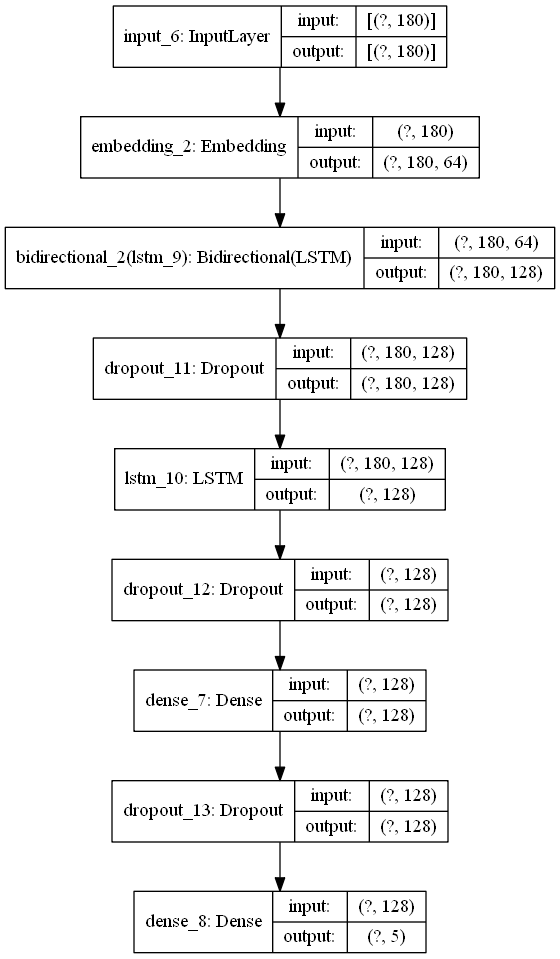

# BBCnews_Classification

<h3 align="left">Languages and Tools:</h3>

      

**Description** : Text sequences datasets/BBC news categorization, to categorize unseen articles into 5 categories 

**Algorithm Model** : Deep Learning method->> LSTM, Long Short Term Memory, BIdirectional 

**Preprocessing step** : TOKENIZER, PADDING, ONE HOT ENCODER

**Objectives** : 
1) To categorize dataset into 5 categories: Sport,Business,Tech,Entertainment,Politics
2) To achieve at least 70% accuracy of model training development

**Flowchart Model** :

 

### Exploratory Data Analysis (EDA)
1) Data Loading
2) Data Inspection
3) Data Cleaning
4) Features Selection
5) Pre-Processing

**Model evaluation** :

`Classification_report`
`accuracy_score`
`Confusion_Matrix`
`Model_train_test_split`
`json`
`pickle`
`EDA`

**Discussion** :

 🟠The dataset is started by loading dataset from raw websites, EDA techniques to inspect duplicated,Null values insdie dataset
 
 🟠Cleaning the dataset by droping duplicated values, use tokenizer to convert all the vocab into number within 10000 words
 
 🟠Padding is introduced to text to ensure all the sequnces have the same lenght
 
 🟠Onehotencoder funtions for y variable(category) in order for Deep Learning training
 
 🟠Sequential_1 getting acc only 0.35% and it is very low with 1 dense layer
 
 🟠Added 1 more dense layer and training it if let say can increase the accuracy 
 
 🟠But, it is getting lower so i will go try use embedding and bidrectional lstm model 
 
 🟠In order to increase the accuracy of the training. p/s: Sequential_3 i got error and i fixed then proceed with Sequential_4
 
 🟠Sequential_4 with 10 epochs, the accuracy increase to 0.56% while Sequential_5, let say try 50 epochs, and also use callback functions
 
 🟠After training, the accuracy increases tremendously and val_acc also increase val_loss getting decreases as the epoch stops at 24, the val_acc is 76%
 
 🟠# From the plotting visualisation, on the epoch loss section, starting at epoch 2, the validation become overfitting even though im already use early stopback, maybe the training epoch is low, well we can try to improvise it by increase the number of epoch
 
 🟠# Besides, we can try to overcome this accuracy by increasing the dropout rate.Other DL architecture also can be use such as transformer,BERT Model,GPT3 Model
 
 **Conclusion** :
 
🗡️ The f1 score,recall,precision accuracy can be obtain from classification report

🗡️ by import confusion matrix,accuracy_score module to summarise the training statistic

🗡️ the model accuracy is 76% which is still acceptable to do model deployment

🗡️ Nevertheless, we can still imporove the training and fit it with other model architecture

🗡️ Proceed to Model H5 save
 
**Dataset** :

[Datasets](https://raw.githubusercontent.com/susanli2016/PyCon-Canada-2019-NLP-Tutorial/master/bbc-text.csv)

**Credits** : 

[Credit to susanli2016](https://github.com/susanli2016)

<h3 align="left">Connect with me:</h3>

www.linkedin.com/in/omarhaziq

**Enjoy Coding!** 🚀
 
